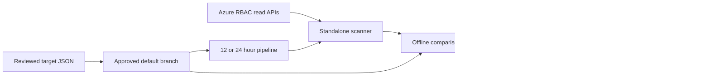

# Approved RBAC target state and scheduled drift detection

**Selected deployment:** GitHub Actions every 12 hours, at 00:23 and 12:23 UTC.
The workflow is configured locally; live activation requires approved target
files and the federated Azure identity in a private deployment repository.

## What is delivered

Cloud platform and identity teams can define approved Azure RBAC assignments in
reviewed JSON files, merge those approvals into their repository, and compare a
fresh Azure scan with that revision every 12 or 24 hours. Reports identify missing,
unexpected, changed and duplicate assignments, plus permission changes in pinned
role definitions. The scanner reports differences for human review; it has no
remediation command.

The CLI, offline web comparison, synthetic demo, JSON schemas, GitHub Actions
workflow and Azure DevOps pipeline are implemented. Live-tenant and hosted
pipeline acceptance still require deployment configuration and a real run.



## Design decisions

**Chosen:** a standalone collector with a pure comparison engine inside RoleGraph.
This keeps Azure sessions out of the web application, reuses Python and Pydantic,
and lets the same engine run locally or in either pipeline platform. An embedded
scheduler would require a continuously running app and new credential handling;
the existing pipeline scheduler already owns authentication, execution and run
history. There are no new Python dependencies.

**Chosen:** compare actual assignments against explicit approvals, including their
originating scope. A direct Reader assignment at a resource group and a Reader
assignment inherited from its subscription are different approvals. This reveals
broad access and unexpected grants to identities absent from the target files.
Comparing only effective role names would hide those differences.

**Chosen:** use raw ARM records in a separate observation contract. RoleGraph's
existing snapshot importer is intentionally permissive and currently drops ABAC
fields. Its snapshots cannot support a reliable condition-sensitive comparison.
The web page therefore accepts the original `observed.json` from the scanner.

**Chosen:** report failures separately from drift. Unreadable scopes, malformed
records, incomplete pagination, cross-tenant subscriptions, stale observations or
conflicting reads prevent a compliance conclusion. A failed scan cannot reuse an
older report directory. Each successful collection stores its observation, target
fingerprint and optional repository revision alongside the report.

## Define approved permissions

Start from [rbac/examples/approved-state.json](../rbac/examples/approved-state.json).
It contains synthetic IDs and must be edited for your deployment. In a private
repository, place reviewed files under `rbac/approved/`, organized by team or
environment. Every JSON file under the selected directory is part of the baseline.
All files in one scan must belong to one tenant.

```json
{
  "schemaVersion": 1,
  "tenantId": "11111111-1111-1111-1111-111111111111",
  "scopes": [
    {
      "id": "/subscriptions/22222222-2222-2222-2222-222222222222",
      "includeDescendants": true
    }
  ],
  "assignments": [
    {
      "principalId": "aaaaaaaa-aaaa-aaaa-aaaa-aaaaaaaaaaaa",
      "principalName": "Platform readers",
      "roleDefinitionId": "acdd72a7-3385-48ef-bd42-f606fba81ae7",
      "roleName": "Reader",
      "scope": "/subscriptions/22222222-2222-2222-2222-222222222222",
      "justification": "Approved platform visibility"
    }
  ],
  "roleDefinitions": []
}
```

Use Entra **object IDs** for users, groups, service principals and managed
identities; a service principal's application/client ID is not its principal ID.
Names and justification are review aids, not matching keys. Role IDs accept a
GUID or full ARM role-definition ID. Assignment IDs are deliberately not approvals:
recreating an equivalent assignment with a new GUID does not change its permission.

Every grant within the selected coverage must be approved, including the scanner's
own assignment if it is visible there. An explicit `assignments: []` means no grants
are approved. An empty directory is an error. Duplicate approvals, unknown
properties, invalid GUIDs, conflicting scope settings and duplicate JSON keys fail
validation. Scopes shared by multiple files are merged; assignments cannot repeat.

### Scope and inheritance

Subscription, resource group and resource scopes can include descendants. Use
`includeDescendants: false` for an exact boundary plus its inherited assignments.
Management group and `/` scopes require `includeDescendants: false`; enumerate the
subscriptions separately to cover their resources. Management group ancestry
cannot be inferred from its resource ID.

The scanner requests unfiltered assignments for descendants and `atScope()` for
assignments at or above each boundary, follows every `nextLink`, and deduplicates
the same assignment ID across queries. It retains the original assignment scope.
If an inherited management-group grant is approved, add that management group as
an explicit scan scope and approve the grant there. This also audits all grants
at that management group. The REST API supports conditions in version
`2022-04-01` and requires `Microsoft.Authorization/roleAssignments/read`.
[Microsoft API reference](https://learn.microsoft.com/en-us/rest/api/authorization/role-assignments/list-for-scope?view=rest-authorization-2022-04-01).

### Conditions and role permission changes

For a conditional assignment, add both `condition` and `conditionVersion: "2.0"`.
Condition expressions are compared exactly, including letter case, whitespace and
quoted values. A removed or textually changed condition is drift; the engine does
not execute the expression or prove two different expressions equivalent.
`delegatedManagedIdentityResourceId` is also compared when present.

To detect a custom role being broadened without an assignment changing, add its
full ID and approved permission blocks to `roleDefinitions`:

```json
{
  "id": "/subscriptions/22222222-2222-2222-2222-222222222222/providers/Microsoft.Authorization/roleDefinitions/cccccccc-cccc-cccc-cccc-cccccccccccc",
  "permissions": [{
    "actions": ["Microsoft.Storage/storageAccounts/read"],
    "notActions": [],
    "dataActions": [],
    "notDataActions": []
  }]
}
```

All four permission arrays are required. Permission order and action casing do
not cause drift. Changes to an unpinned role's permissions are outside this scan.
Pin built-in roles too if changes to their definitions must be reviewed.

## Run locally

Install the existing application and development dependencies as described in
[README.md](../README.md). From the repository root:

```bash
.venv/bin/python -m rolegraph.drift validate --target rbac/examples/approved-state.json
.venv/bin/python scripts/demo_rbac_drift.py --output-dir artifacts/rbac-demo
.venv/bin/python -m rolegraph.drift check \
  --target rbac/examples/approved-state.json \
  --observed artifacts/rbac-demo/observed.json \
  --output-dir artifacts/rbac-demo-check
```

The synthetic demo shows approved Reader missing and unexpected Owner present.
The final command intentionally exits **1** because drift exists. Use a new output
directory for each run. Offline observations must be no more than 36 hours old
(allowing the latest daily scan to be reviewed);
the CLI's `--max-age-hours` can explicitly widen that limit for historical review.
Observations more than five minutes in the future are rejected.

Start RoleGraph and open **RBAC drift**. Select one or more approved JSON files
and a fresh `observed.json` from the scanner. The page compares without saving
approvals, modifying existing snapshots or making cloud calls. The older full
tenant export from `Export-RoleGraphDataset.ps1` is a different format; it is not
accepted as proof of a complete scan by this feature.

For live collection, first configure an Azure CLI session for the approved tenant:

```bash
.venv/bin/python scripts/scan_rbac.py \
  --target rbac/approved \
  --output-dir artifacts/rbac-run-001 \
  --revision YOUR_APPROVED_COMMIT_SHA
```

The script reads the existing public-Azure session, verifies each explicitly
configured subscription and pinned-role subscription, then invokes ARM GETs.
It does not log in or change the selected subscription. ARM throttling and selected
transient gateway errors receive bounded retries. A required read failure stops
the run. Use a stable collection window if concurrent changes cause conflicts.

| Exit | Result | Operator action |
|---|---|---|
| 0 | In sync within declared coverage | Retain evidence |
| 1 | Permission drift | Review findings against the approved commit |
| 2 | Configuration or scan error | Restore collection and run again |

Reports are `report.json` and `report.md`; successful scans also include
`observed.json`. A scan can find drift and still have collected successfully.
Missing, unexpected and duplicate findings retain Azure assignment IDs; changed
conditions and role permissions include expected and observed evidence.

## Schedule using GitHub Actions

Use a **private deployment repository** for real target state and evidence. The
shipped workflow deliberately skips live collection in a public repository.

1. Configure reviewed JSON files in `rbac/approved/` and merge them into the
   default branch. Require PR review from the identity/platform owner and require
   the `Validate RBAC targets` check. Protect the target directory, scanner code
   and workflow files with your organization's CODEOWNERS and branch rules.
2. Create an Entra application or user-assigned managed identity with a federated
   credential for the GitHub environment `rbac-audit`. Restrict that environment
   to the approved default branch. Configure its audience for Azure token exchange.
   Use a dedicated scan identity with Reader on the configured scopes and the
   pinned role definition scopes, or a tested custom role with the required reads.
3. Create environment secrets `AZURE_CLIENT_ID`, `AZURE_TENANT_ID` and
   `AZURE_SUBSCRIPTION_ID`. These identify the federated session; no client secret
   is required. Set repository variable `RBAC_DRIFT_ENABLED=true` after setup.
4. Run **RBAC drift scan (every 12 hours)** manually on the default branch, verify the
   coverage and evidence, then allow the schedule to run. PR validation never
   logs in to Azure. The scheduled job requests `id-token: write` only for its
   federated login. [GitHub Azure OIDC setup](https://docs.github.com/en/actions/how-tos/secure-your-work/security-harden-deployments/oidc-in-azure).

[The selected workflow](../.github/workflows/rbac-drift.yml) uses `23 0,12 * * *`, meaning
00:23 and 12:23 UTC, every 12 hours. These are
scheduler targets, not an exact execution-time guarantee: scheduled jobs can be
delayed. Runs use the default branch. See [GitHub scheduled events](https://docs.github.com/en/actions/reference/workflows-and-actions/events-that-trigger-workflows#schedule).

The job fails on drift or collection error while retaining a summary and 30-day
artifacts. Enable workflow-failure notifications using your team's existing
GitHub notification settings. Monitor the timestamp of the last **successful
collection**, not just the last workflow, so disabled or skipped schedules are
visible operationally. No email, Teams or Slack messages are sent by this code.

## Schedule using Azure DevOps

Use [pipelines/azure-rbac-drift.yml](../pipelines/azure-rbac-drift.yml) in a private
Azure DevOps Services project. Create an ARM service connection using workload
identity federation; set pipeline variable `AzureRbacReadConnection` to its name
and authorize only this pipeline. Ensure its Azure permissions are Reader/the
required reads rather than the Contributor role a generic deployment connection
may receive. Configure the same target directory and review process.

This pipeline also uses `23 */12 * * *`; replace with `23 0 * * *` and update its
display name for 24 hours. Both the branch filter and job guard use `main`; update
both if your approved branch differs. `always: true` makes the scan run even when
the repository is unchanged. Remove any UI-defined schedule that overrides YAML.
[Azure Pipelines schedule behavior](https://learn.microsoft.com/en-us/azure/devops/pipelines/process/scheduled-triggers?view=azure-devops).

The `AzureCLI@2` task supplies the federated session. Reports are retained through
the pipeline artifact task even when drift fails the command. Set project build
retention and failure notifications to your evidence requirements. The artifact
task is for Azure DevOps Services; Azure DevOps Server installations need their
supported artifact task instead.
[Azure CLI task](https://learn.microsoft.com/en-us/azure/devops/pipelines/tasks/reference/azure-cli-v2?view=azure-pipelines),
[pipeline artifact task](https://learn.microsoft.com/en-us/azure/devops/pipelines/tasks/reference/publish-pipeline-artifact-v1?view=azure-pipelines).

## Requirements and acceptance

As a platform owner, I can review intended assignments in a PR so approval has an
auditable repository revision. As an operator, I can distinguish access drift from
collection failures. As a security reviewer, I can inspect the exact unexpected
grant or changed condition without granting the scanner write permissions.

P0 acceptance: malformed or ambiguous baselines fail; exact matches pass; extra
identities and grants are detected; missing grants are detected; condition changes
are detected; all declared scopes must complete; report artifacts survive drift;
the same inputs and clock give the same report; the web app stays offline.
P1 delivered: multiple files, pinned role permissions, duplicate-grant evidence,
GitHub and Azure DevOps templates, and an offline web review.

Success targets: all P0 regression cases pass before release; deployment acceptance
demonstrates one matching, one deliberately changed, and one failed-read scan;
operators receive an actionable result within one configured schedule interval
plus actual queue/run time. No production adoption or response-time measurements
are claimed yet.

## Coverage limits and next work

This is Azure **role-assignment** governance. It does not calculate net effective
actions, validate principal existence through Graph, track Entra directory roles,
evaluate group membership drift, PIM eligibility, deny assignments, Lighthouse,
or service-specific data-plane ACLs. Active PIM grants that appear in
`roleAssignments` participate in the comparison and can be reported as unexpected.
There is no automatic deletion, grant, approval, exception expiry or group change.
Public Azure is the supported cloud for the collector.

Explicit subscription lists avoid automatic discovery silently omitting a
subscription. They still require review as the estate grows. Visibility is limited
to what Azure returns to the scanner identity; a successful response does not
prove that an unspecified subscription or another tenant was audited. A scan is a
sequence of reads, not an atomic tenant-wide snapshot.

Next priorities are production acceptance of one approved tenant, group membership
and PIM target models, then an authenticated report history with missed-run alerts.
Deployment owners must supply the real tenant/scope inventory and scan identity.
GitHub Actions and the 12-hour cadence have been selected. The remaining deployment
configuration does not block local implementation.

## Local verification

Verified September 7, 2026: **247 tests passed**, including the original PowerShell
collector tests and 66 new drift/schema/collector/web cases. The installed FastAPI
and Starlette versions emit two upstream deprecation warnings; there were no
test failures. Reproduce with:

```bash
ROLEGRAPH_PWSH=/path/to/pwsh .venv/bin/python -m pytest
```

Actionlint 1.7.12 validated both GitHub workflows. The Azure DevOps YAML parsed
successfully, and both published JSON schemas matched their runtime models.
The offline demo and comparison CLI returned the expected drift result.

A real loopback Uvicorn server and headless Chrome exercised the new page at
1440px and 390px: the named Reader/Owner differences and incomplete-scan error
state rendered correctly, with no horizontal page overflow, browser errors or
external requests. The existing Contoso import/identity journey also passed.
Local evidence is in `artifacts/rbac-browser-check.json`,
`artifacts/rbac-drift-1440.png` and `artifacts/rbac-drift-390.png`.
These ignored artifacts contain synthetic data. Docker, live Azure, OIDC and
hosted pipeline execution were not exercised for this change.
