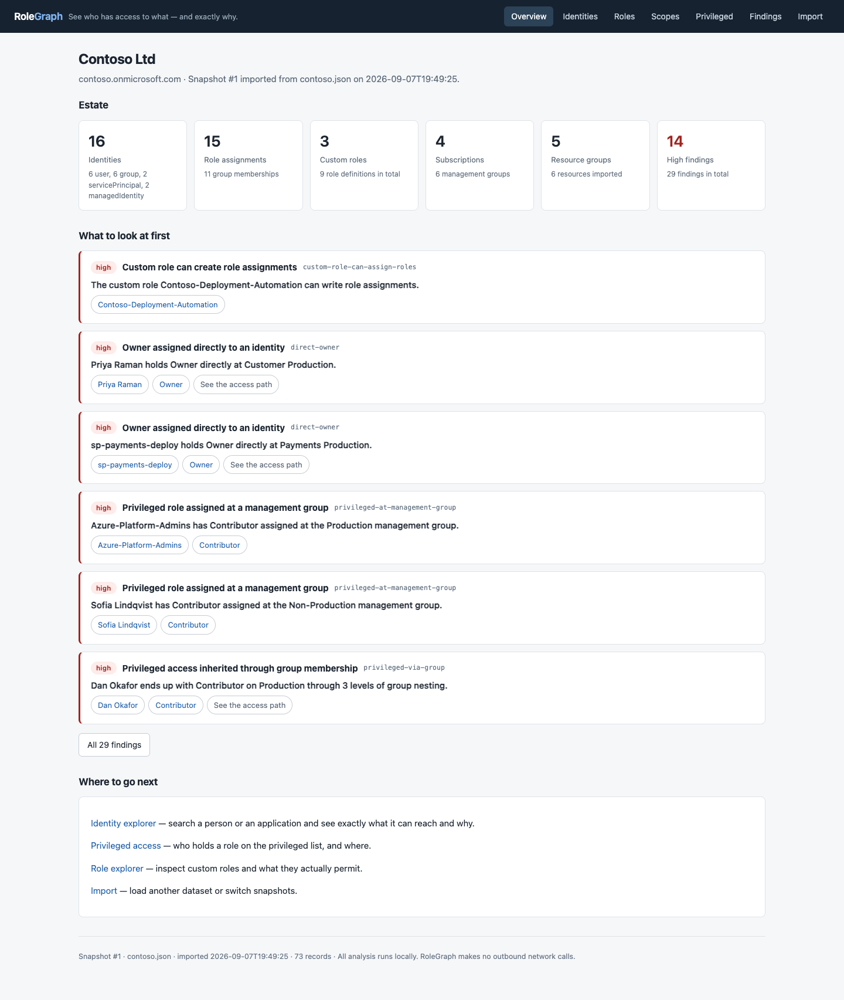
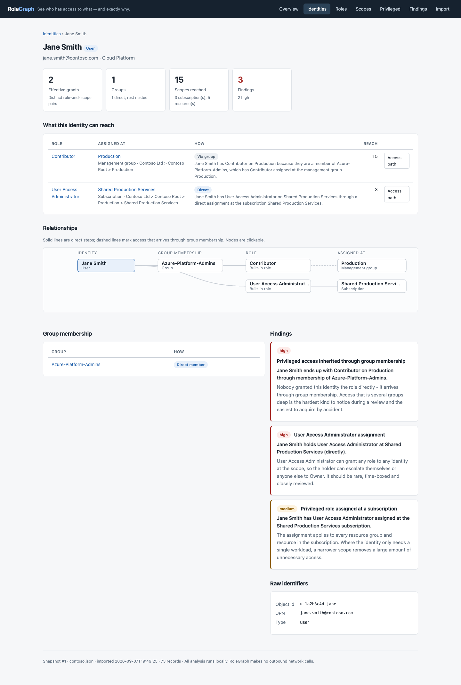
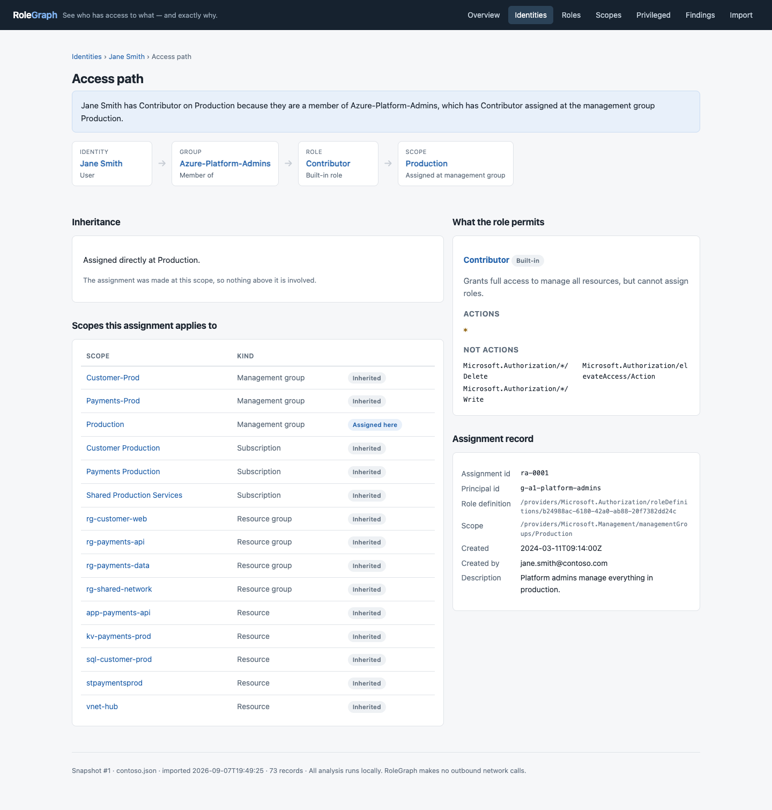
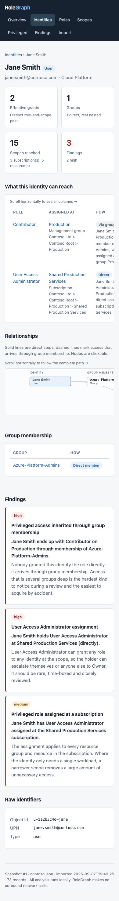

# RoleGraph screenshots

Captured September 7, 2026 from the development build using the synthetic
Contoso dataset. No real Azure tenant was accessed. These images preview local
UI polish; the accompanying publication is documentation-only, not a release of
the collector or application changes.

All 27 captures passed the automated browser/layout checks. The
[capture manifest](manifest.json) records the browser version, routes and viewports.
Desktop images use 1440 × 1000 viewports, phone images 390 × 844, and the tablet
image 768 × 1024. Full-page captures extend vertically beyond the viewport.

Click any link to open its full-resolution image.

| Screen | Desktop | Phone |
|---|---|---|
| First-run welcome | [View](01-empty-1440.png) | [View](01-empty-390.png) |
| Demo import summary | [View](02-imported-1440.png) | [View](02-imported-390.png) |
| Estate overview | [View](03-overview-1440.png) | [View](03-overview-390.png) |
| Identity search | [View](04-search-1440.png) | [View](04-search-390.png) |
| Identity and relationships | [View](05-identity-1440.png) | [View](05-identity-390.png) |
| Access-path explanation | [View](06-access-path-1440.png) | [View](06-access-path-390.png) |
| High-severity findings | [View](07-findings-1440.png) | [View](07-findings-390.png) |
| Role search | [View](08-roles-1440.png) | [View](08-roles-390.png) |
| Role detail | [View](09-role-detail-1440.png) | [View](09-role-detail-390.png) |
| Scope hierarchy | [View](10-scopes-1440.png) | [View](10-scopes-390.png) |
| Privileged access | [View](11-privileged-1440.png) | [View](11-privileged-390.png) |
| Empty search results | [View](12-no-results-1440.png) | [View](12-no-results-390.png) |
| Invalid-file rejection | [View](13-import-error-1440.png) | [View](13-import-error-390.png) |

[Tablet identity view](05-identity-768.png).

## Overview

Identity and relationship diagram

Access-path explanation

Phone layout

[Back to the project README](../../README.md).
